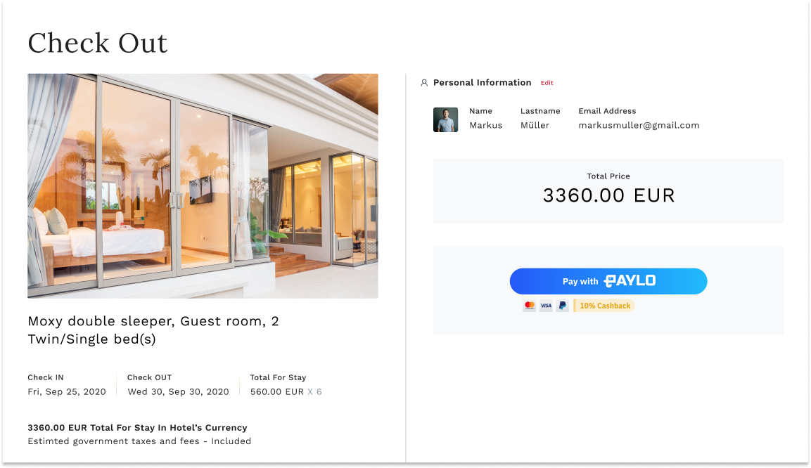

# Paylo Payments Demo

The Paylo API offers a wealth of data, which can be visualised in many different ways. Based on our experiences, we have assembled a set of example layouts for you to explore. They cover the basic views typically encountered on a hotel booking website. Take these as additional inspiration for your own visualization, and explore the source code to understand how to process an API response to get the most out of our service.

**You can see this demo app running in test mode on [demo.pay-lo.com](https://demo.pay-lo.com/).**

## Overview



## Payments Integration

The frontend code for the demo is in the `src/` directory.

The code logic of the Paylo integration contained within `src/pages/Room/index.js` file for creates the payment experience on the frontend using Paylo API.

## Prerequisite

- API key request from merchant dashboard [Documentation](https://developer.pay-lo.com)

## Quick Start

In this case we used fetch in client side to request to Paylo server but not recomended the flow should be request from server side in case for you api key security.
this project are based on [Reactjs framework](https://reactjs.org)

## How to run locally

**Clone and Install project**

you can clone and configure following this steps

clone Paylo sample project locally

```bash
git clone git@github.com:20Scoops-CNX/paylo-payments-demo.git
```

Install project denpendencies

```bash
cd paylo-payments-demo && yarn install
```

**Configuration api key**

in this sample you gonna use api key directly from source code you can go to `src/pages/Room/index.js` in section

```js
    {
        pbkey: '{{PUBLIC_KEY}}',
        pvkey: '{{PRIVATE_KEY}}',
        amount: 100,
        name: 'Markus Müller',
        email: 'paylomerchant1@gmail.com',
        success_url: '{{YOUR_SUCCESS_URL: http://localhost:3000/results}}',
        fail_url: '{{YOUR_FAIL_URL: http://localhost:3000/failed}}',
        back_url: '{{YOUR_BACK_URL: http://localhost:3000/home}}'
    }
```

**Recomended** : secret keys use in your server side environment should be more securely.

change `pbkey` and `pvkey` from your api key that you get from paylo dashboard
and change `success_url`, `fail_url`, `back_url` to locally url as example in above.
to see full documentation [Document](https://developer.pay-lo.com/#/api-payment?id=payment-api)

**Run project locally**

you can run the example project following command

```js
yarn start
```

so now you and enter and getting start with the example project now.
